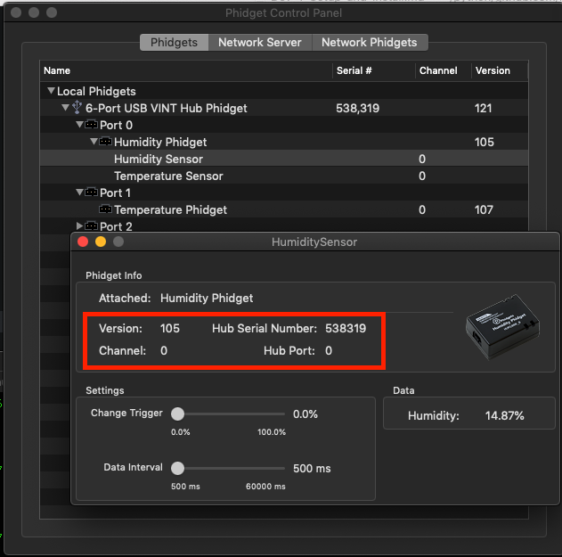

# Mika Thing Setup and Installation
## Hardware Installation and Setup
We will be using [Phidgets](https://www.phidgets.com) in our application so you will need to install the the [drivers specific to your operating system](https://www.phidgets.com/docs/Operating_System_Support) before proceeding further. Please follow the instructions found on their website and have them installed.

## Hardware Configuration Variables
Once you have [installed the drivers](https://www.phidgets.com/docs/Operating_System_Support) you are now ready to moving forward! Please look in your **Phidgets Control Panel** and please write down the following values from your devices:

* Serial Number
* Hub Port Number
* Channel Number

Here is how it would look on MacOS and the highlighted red-box is where the values can be found.



## Installation
1. Clone the project.

    ```
    cd ~/
    git clone https://github.com/mikasoftware/mikathing.git
    cd ~/mikathing
    ```


2. Setup our virtual environment

    ```
    virtualenv -p python3.6 env
    ```


3. Now lets activate virtual environment

    ```
    source env/bin/activate
    ```


4. Now lets install the libraries this project depends on.

    ```
    pip install -r requirements.txt
    ```

5. In the ``src`` directory create a file called ``.env`` and populate it with the following content:

    ```
    # THE FOLLOWING VARIABLES ARE SET ACCORDING TO YOUR PHIDGET DEVICE VALUES.
    # PLEASE REVIEW THE PHIDGETS.COM WEBSITE TO GET MORE INFORMATION HOW TO GET
    # THESE VALUES FROM YOUR COMPUTER.
    HUMIDITY_SERIAL_NUMBER=538319
    HUMIDITY_VINT_HUB_PORT_NUMBER=0
    HUMIDITY_CHANNEL_NUMBER=0
    TEMPERATURE_SERIAL_NUMBER=538319
    TEMPERATURE_VINT_HUB_PORT_NUMBER=0
    TEMPERATURE_CHANNEL_NUMBER=0

    # THE FOLLOWING VARIABLES ADJUST THE OPERATION OF THIS APPLICATION.
    APPLICATION_DATA_INTERVAL_IN_MINUTES=5
    APPLICATION_DATABASE=thing.db
    ```

6. Please change the contents of the ``.env`` file to match the configuration found in your systen.

## Usage

```
python mikathing.py
```
