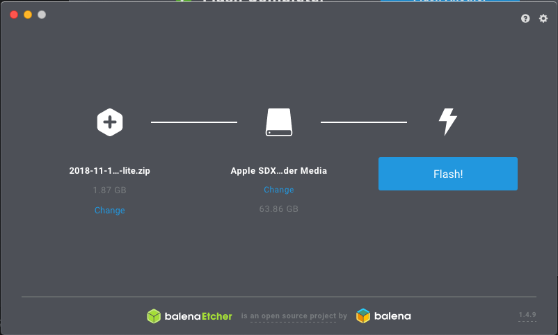
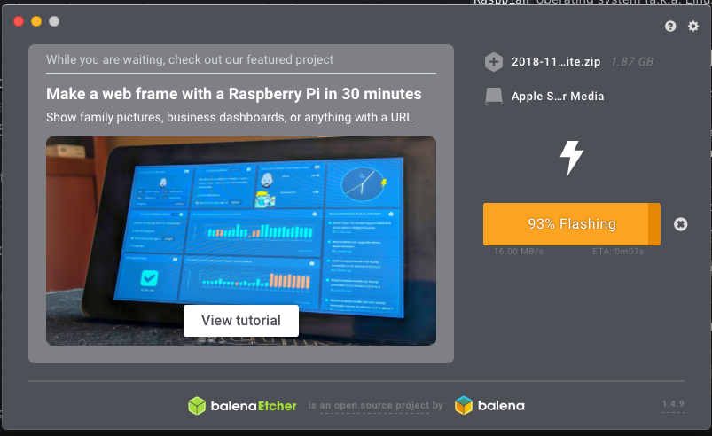
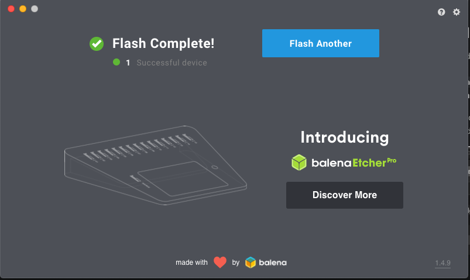
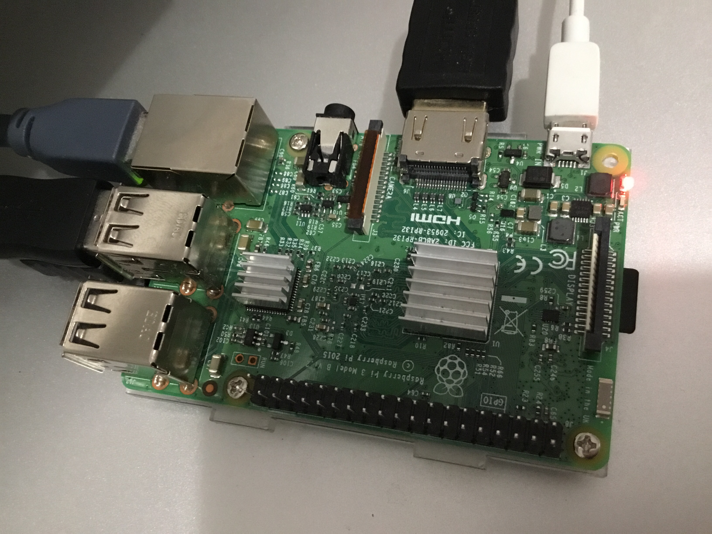

# Mika Thing Setup and Installation on Raspbian
The following are instructions on how to setup ``Mika Thing (Python)`` project on ``Raspbian`` operating system (a.k.a. Linux).

## Hardware Installation and Setup
Please note these instructions were made from MacOS.

1. Start by downloading a copy of ``Raspbian`` from [the following link](https://www.raspberrypi.org/downloads/raspbian/). It is recommended to download the **Raspbian Stretch Lite** version.

2. Open up the app [Balena Etcher](https://www.balena.io/etcher/?ref=etcher_footer) and write the OS image to the SD card. If you've set everything up properly, you should see something like this:

  

3. Click start and you should see something like this.

  

4. Click start and you should see something like this.

  

5. Afterwords eject the SD Card and insert it into the ``Raspberry Pi``. Turn on the device.

  

6. On your monitor you should see the login prompt. This means you have successfully setup ``Raspbian``.

  

7. Login using the following credentials:

  ```
  Username: pi
  Password: raspberry
  ```

8. Once you have successfully logged in, run the following command to enable ``SSH`` daemon. You will be able to remotely log into the ``raspberrypi`` from your computer afterwords.

  ```
  sudo systemctl enable ssh
  sudo systemctl start ssh
  ```

8. Confirm you are able to log in. Run the following code on developer computer. Note: I found the IP address to be 192.168.0.27.

  ```
  ssh -l pi 192.168.0.27
  ```

## Installation
The following instructions are done through the ``SSH`` session.

### Python 3.6
We want to support ``python3``.

1. Run the following to install the pre-requisites.

  ```
  sudo apt-get install build-essential checkinstall
  sudo apt-get install libreadline-gplv2-dev libncursesw5-dev libsqlite3-dev tk-dev libgdbm-dev libc6-dev libbz2-dev
  ```

2. Download and unzip ``Python3``.

  ```
  cd /usr/src
  sudo wget https://www.python.org/ftp/python/3.6.0/Python-3.6.0.tgz
  sudo tar xzf Python-3.6.0.tgz
  ```

3. Compile and install ``Python3``.

  ```
  sudo -s
  cd Python-3.6.0
  bash configure
  make altinstall
  exit
  ```

4. Install ``pip` for ``Python3``.

  ```
  sudo apt-get install python3-pip
  ```


### Phidgets with Raspberry Pi
1. Install ``git``.

  ```
  sudo apt install git
  ```

2. Install ``virtualenv``.

  ```
  sudo apt install virtualenv
  ```

3. Steps 3 to X are taken from [phidgets linux instructions](https://www.phidgets.com/docs/OS_-_Linux#Quick_Downloads).

4. Install our generic USB library.

  ```
  sudo apt install libusb-1.0-0-dev
  ```

5. Download our Linux drivers.

  ```
  wget https://www.phidgets.com/downloads/phidget22/libraries/linux/libphidget22.tar.gz
  ```

6. Unzip

  ```
  tar zxvf libphidget22.tar.gz
  ```

7. Go into the directory.

  ```
  cd libphidget22-1.0.0.20190129/
  ```

8. Pre-compile the code.

  ```
  ./configure
  make
  ```

9. Compile the code and install. Please note once this command is run the compilation time will take a while.

  ```
  sudo make install
  ```


### Mika Thing (Python) with Raspberry Pi
1. Clone our project.

  ```
  cd ~/
  git clone https://github.com/mikasoftware/mikathing.git
  cd ~/mikathing
  ```

2. Setup our virtual environment

  ```
  virtualenv -p python3.6 env
  ```

3. Now lets activate virtual environment

  ```
  source env/bin/activate
  ```

4. Now lets install the libraries this project depends on.

  ```
  pip install -r requirements.txt
  ```

5. In the ``src`` directory create a file called ``.env`` and populate it with the following content:

  ```
  # THE FOLLOWING VARIABLES ARE SET ACCORDING TO YOUR PHIDGET DEVICE VALUES.
  # PLEASE REVIEW THE PHIDGETS.COM WEBSITE TO GET MORE INFORMATION HOW TO GET
  # THESE VALUES FROM YOUR COMPUTER.
  HUMIDITY_SERIAL_NUMBER=538319
  HUMIDITY_VINT_HUB_PORT_NUMBER=0
  HUMIDITY_CHANNEL_NUMBER=0
  TEMPERATURE_SERIAL_NUMBER=538319
  TEMPERATURE_VINT_HUB_PORT_NUMBER=0
  TEMPERATURE_CHANNEL_NUMBER=0

  # THE FOLLOWING VARIABLES ADJUST THE OPERATION OF THIS APPLICATION.
  APPLICATION_DATA_INTERVAL_IN_MINUTES=5
  APPLICATION_DATABASE=thing.db
  ```

6. Please change the contents of the ``.env`` file to match the configuration found in your systen.

7. Once you are ready, run the application!

  ```
  python mikathing.py
  ```
