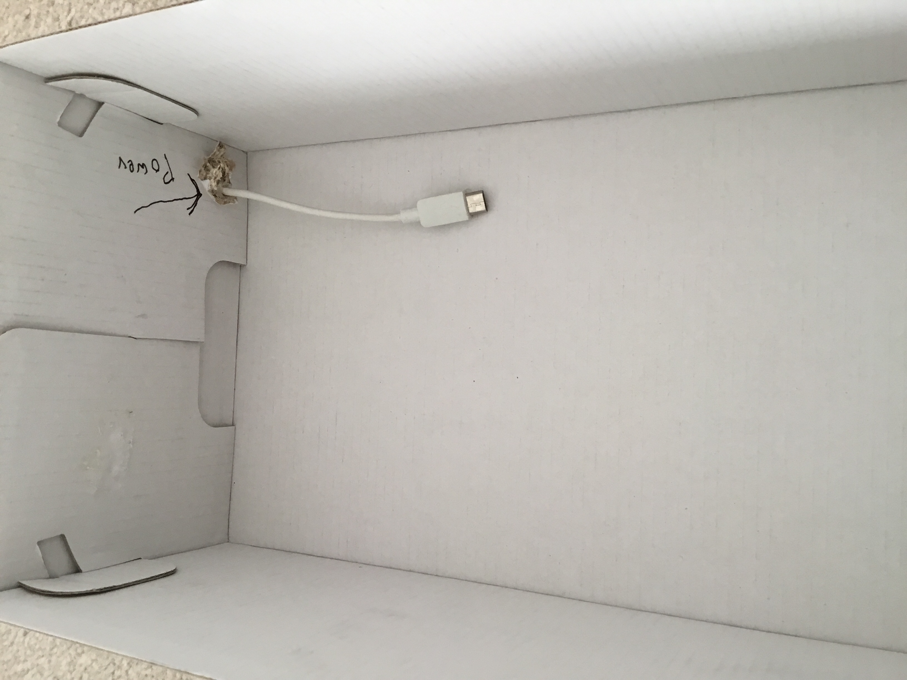
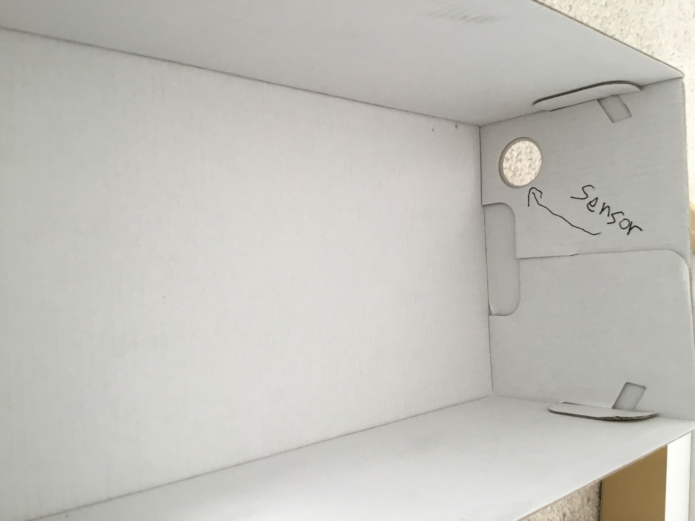
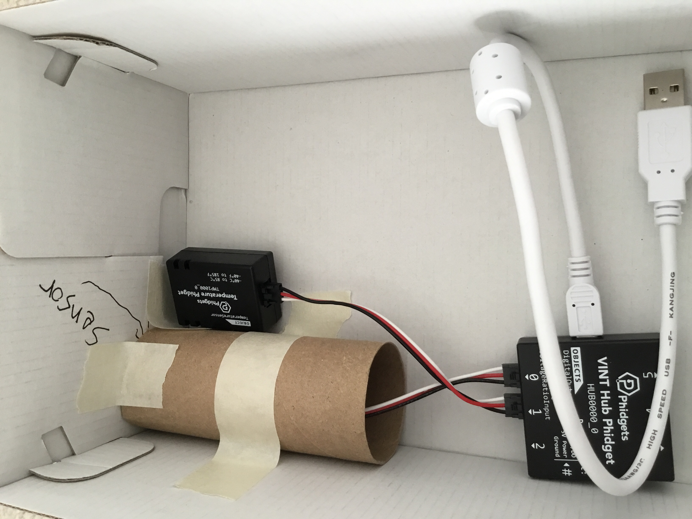
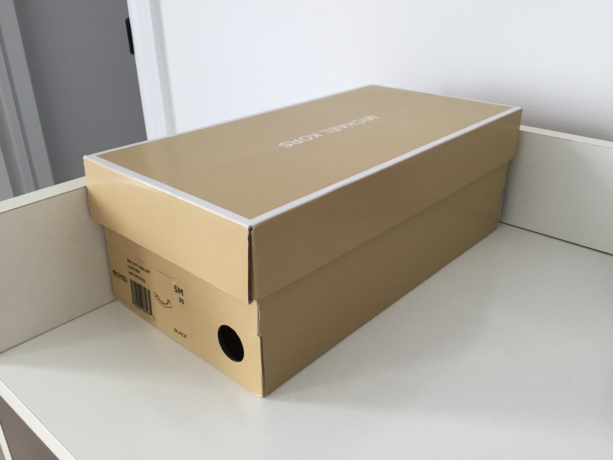

# Building a Prototype Case

## Step 1
Find a box. Cut out a hole in one side so the power cable can come in.

## Step 2
Cut out a hole on the other side of the box so the sensor can be facing the outside environment.

## Step 3
Add the [Phidget Humidity Sensor]() into a cardboard role and face it to the sensor hole. Place the extra [Phidget Temperature Sensor]() in the inside of the box. Attach the sensors to the [Phidget VINT Hub]().

## Step 4
Connect everything together.

## Step 5
Turn on and close box.

